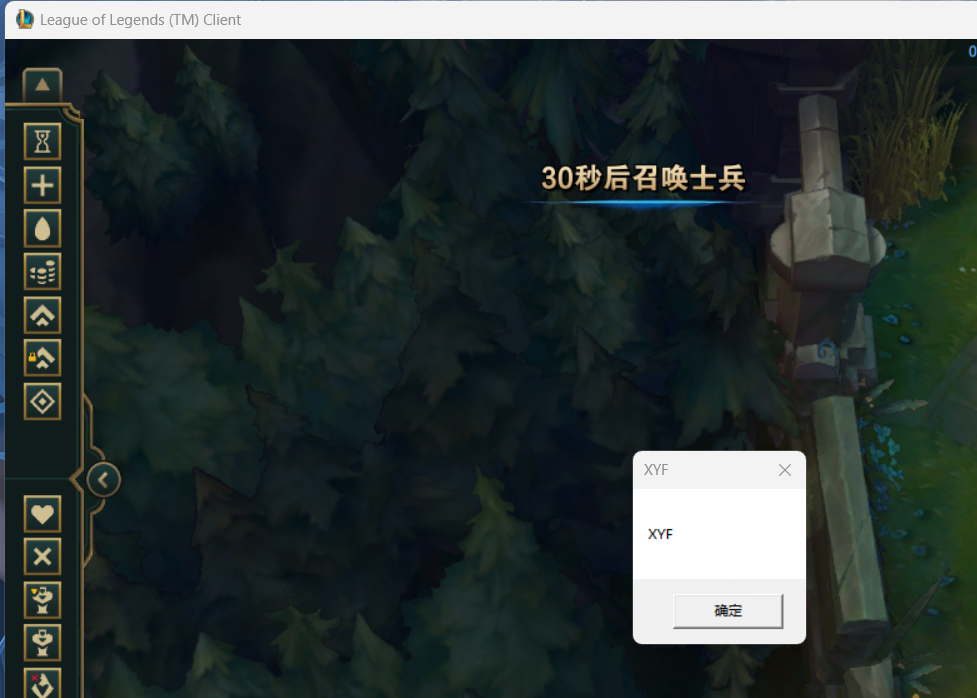

# SetWindowHookEx注入过程

## 原理

Windows钩子技术允许程序在某些时间发生后进行拦截并处理操作系统消息、事件、其他程序的输入输出，是一种操作系统提供的机制

全局钩子或跨进程钩子，钩子的回调函数在.dll文件中，SetWindowHookEx将进程安装钩子后，被安装钩子的进程回在加载内存中的.dll文件（dll注入原理）

钩子依附于线程，线程处理消息的机制时消息循环，所以要求安装钩子的线程需要调用GetMessage和PeekMessage（安装条件）

## 过程

- 通过FindWindow函数以及L0L的窗口名（League of Legends (TM) Client）找到该窗口的句柄

- 通过GetWindowThreadProcessId函数获取该窗口对应的进程的进程ID和线程ID

- 当前进程加载dll，获取函数地址

- SetWindowsHookEx对线程ID和函数地址作为参数进行跨进程钩子的安装（可选择手动或自动）

  

- 不需要使用后UnhookWindowsHookEx进行卸载钩子